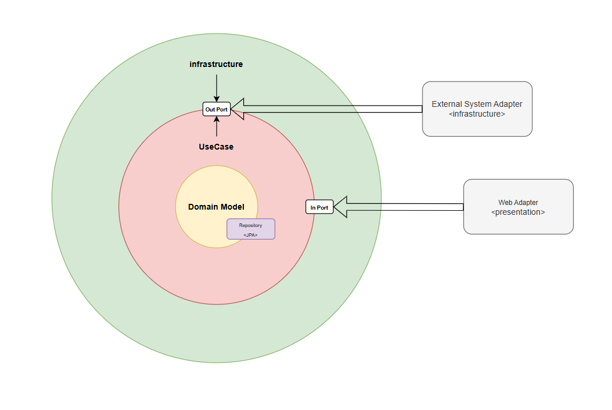

### 아키텍처 설명

**Domain Model**: 도메인 엔티티를 설계

- 외부 계층과 의존되게 설계하면 안되지만, JPA에 종속된 설계로 개발의 편리성과 실용성을 챙김
- Repository도 그것에 따라 구현

**Use Case**: 실제 비즈니스 로직 설계

- In Port: presentation 계층의 의존성을 줄이기 위해 Use Case Interface 설계
- Out Port: infrastructure 계층의 의존성을 줄이기 위해 외부 시스템의 interface 설계

infrastructure: 외부 시스템과 연결 부분 설계

- Out Port Interface를 직접적으로 구현 -> Out Adapter
- 외부 시스템과 연결되는 구조를 정의

presentation: 실제 사용자에게 표현하는 부분 설계

- In Port Interface를 의존 받아 실제 비즈니스 로직을 수행 후 사용자에게 보여주는 역할 ->In Adapter

### 해당 서비스 규칙
1. 도메인 모델과 리포지토리는 JPA에 종속
    - DIP를 위반하는 행위
    - 하지만 도메인 모델과 리포지토리는 거의 바뀔 염려가 없음
        - 이러한 이유로 도메인 엔티티와 DB 엔티티를 분리하고, 따로 매퍼를 만들어서 하는 것은 개발의 향상성과 편리성이 저하될 수 있음. → trade-off
            - 각각의 장단점이 존재하지만, 이번 서비스는 고정
        - 혹시나 문제가 발생될 경우, 직접 그 문제를 겪어보며 왜 필요한지, 왜 중요한지를 알 수 있는 계기가 될 수 있음
2. 바운디드 컨텍스트 별로 코드를 분리
3. 바운디드 컨텍스트 경계를 해치지 않는 코드들은 외부로 뺌
    - config
        - 단순 코드 설정 파일이 아닌, 특정 영역에 대한 전역적인 동작 방식을 정의하고 제어하는 코드 포함
    - shared-kernel
        - 두개 이상의 컨텍스트 간의 공유되는 모델을 정의

### Leaf-Log 란??
<프로젝트 완성 시 공개>

### Context Map
<프로젝트 완성 시 공개>

